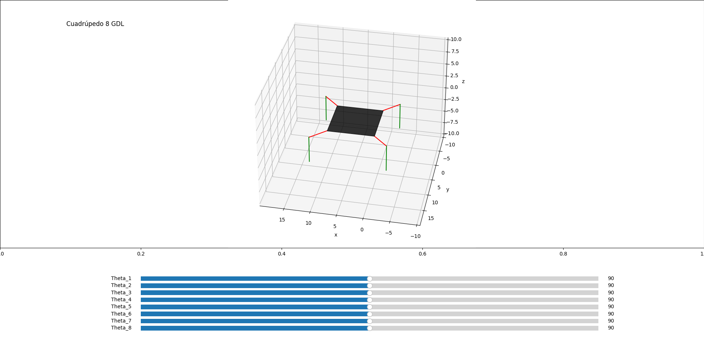

# Quadruped motion simulation

Motion simulation of a Quadruped Robot using direct kinematics. 8 DOF can be manipulated.

## Requirements

This module requires the following modules:
- [Numpy](https://numpy.org/)
- [Matplotlib](https://matplotlib.org/)